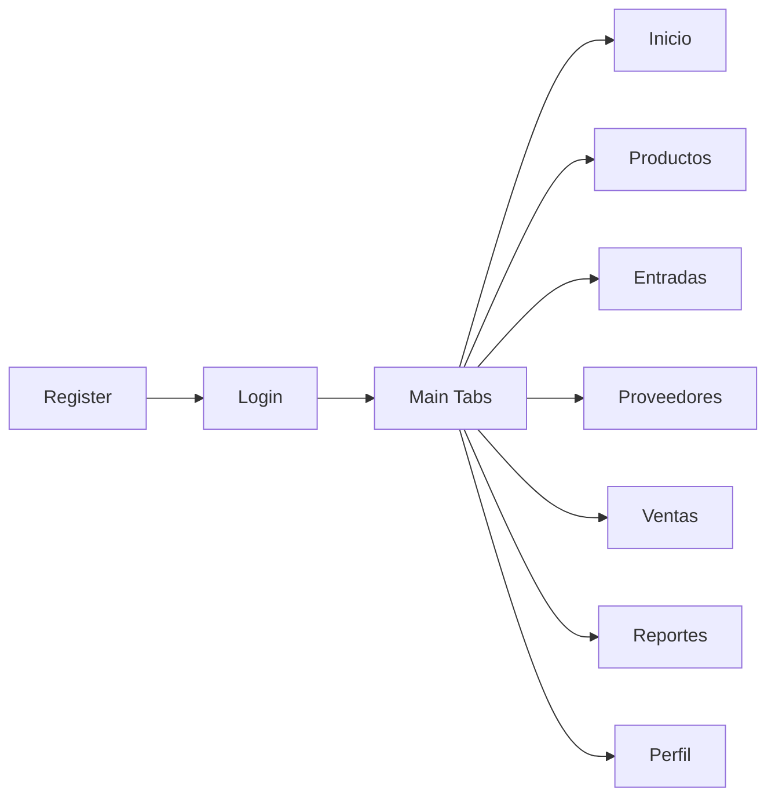

# VentaTotal Móvil

Cliente móvil del ERP construido con React Native + Expo. Esta app consume la API de Laravel para autenticación y operación diaria de inventario, ventas y proveedores.

## Tabla de contenido

- [1. Resumen](#1-resumen)
- [2. Tecnologías](#2-tecnologías)
- [3. Estructura de carpetas](#3-estructura-de-carpetas)
- [4. Flujo de navegación](#4-flujo-de-navegación)
- [5. Requisitos](#5-requisitos)
- [6. Instalación y arranque](#6-instalación-y-arranque)
- [7. Configuración de API](#7-configuración-de-api)
- [8. Endpoints esperados](#8-endpoints-esperados)
- [9. Dependencias principales](#9-dependencias-principales)
- [10. Conexión con ngrok](#10-conexión-con-ngrok)
- [11. Troubleshooting](#11-troubleshooting)

## 1. Resumen

Objetivo:

- Operar procesos clave del ERP desde móvil.
- Reutilizar la logica central del backend via API.

Modulos incluidos:

- Inicio
- Productos
- Entradas
- Proveedores
- Ventas
- Reportes
- Perfil

## 2. Tecnologías

| Categoria | Tecnologia |
|---|---|
| Base | Expo SDK 54, React Native 0.81, React 19 |
| Navegación | React Navigation (Stack + Bottom Tabs) |
| Persistencia | AsyncStorage, SecureStore |
| UI/Charts | Expo Vector Icons, Chart Kit, SVG |

## 3. Estructura de carpetas

```text
AplicacionMovil/VentaTotal/
|-- App.js
|-- index.js
|-- app.json
|-- package.json
|-- assets/
|-- Navigation/
|   `-- MainTabs.js
|-- Screens/
|   |-- LoginScreen.js
|   |-- RegisterScreen.js
|   |-- HomeScreen.js
|   |-- ProductosScreen.js
|   |-- EntradasScreen.js
|   |-- ProveedoresScreen.js
|   |-- VentasScreen.js
|   |-- ReportesScreen.js
|   `-- PerfilScreen.js
|-- config/
|   `-- api.js
`-- utils/
	`-- authStorage.js
```

## 4. Flujo de navegación



## 5. Requisitos

Entorno soportado por el momento:

- Windows

- Node.js 18+
- npm 9+
- Backend Laravel corriendo
- Expo Go o emulador

## 6. Instalación y arranque

```bash
cd AplicacionMovil/VentaTotal
npm install
npm start
```

Comandos útiles:

```bash
npm run android
npm run ios
npm run web
```

Secuencia recomendada:

1. Levantar backend primero.
2. Iniciar Expo.
3. Abrir en Expo Go o emulador.

## 7. Configuración de API

Archivo de configuración: `config/api.js`

Orden de host candidato:

1. `http://172.20.10.4:8000`
2. `http://10.0.2.2:8000` (emulador Android)
3. `http://127.0.0.1:8000`
4. `http://localhost:8000`

Si tu backend usa otra IP o puerto, actualiza `DEFAULT_PORT` y la lista de hosts.

## 8. Endpoints esperados

La app espera API en `/api` con rutas como:

- `POST /api/login`
- `POST /api/register`
- `GET /api/productos`
- `GET /api/proveedores`
- `GET /api/entradas`
- `GET /api/ventas`

Autenticación: token Sanctum.

## 9. Dependencias principales

- Navegación: `@react-navigation/native`, `@react-navigation/native-stack`, `@react-navigation/bottom-tabs`
- Seguridad y storage: `expo-secure-store`, `@react-native-async-storage/async-storage`
- Funcionalidad movil: `expo-image-picker`, `expo-print`, `expo-sharing`
- UI: `@expo/vector-icons`, `expo-linear-gradient`, `react-native-chart-kit`

## 10. Conexión con ngrok

Si tu teléfono no alcanza la IP local del backend, usa ngrok para exponer la API.

### 10.1 Levantar backend

```bash
cd AplicacionWeb/VentaTotal
php artisan serve --host=0.0.0.0 --port=8000
```

### 10.2 Abrir túnel

```bash
ngrok http 8000
```

Ejemplo de URL entregada por ngrok:

- `https://abc123.ngrok-free.app`

### 10.3 Ajustar `config/api.js`

Coloca la URL de ngrok al inicio de `API_CANDIDATES` para priorizarla:

```js
const API_CANDIDATES = [
	"https://abc123.ngrok-free.app",
	`http://172.20.10.4:${DEFAULT_PORT}`,
	Platform.OS === "android" ? `http://10.0.2.2:${DEFAULT_PORT}` : null,
	`http://127.0.0.1:${DEFAULT_PORT}`,
	`http://localhost:${DEFAULT_PORT}`,
].filter(Boolean);
```

### 10.4 Reiniciar Expo

```bash
npx expo start -c
```

Nota:

- En plan gratuito la URL cambia cada vez que reinicias ngrok.

## 11. Troubleshooting

- Error de red: revisar host y puerto en `config/api.js`.
- Emulador Android sin conexion: usar `10.0.2.2`.
- Error de cache Expo: ejecutar `npx expo start -c`.
- Login falla: validar backend activo, migraciones y usuario.
