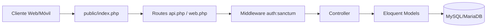

# VentaTotal Web

Backend API del ERP construido en Laravel. Gestiona autenticación, catálogos, inventario, compras y ventas; además compila assets frontend con Vite.

## Tabla de contenido

- [1. Resumen](#1-resumen)
- [2. Stack](#2-stack)
- [3. Estructura de carpetas](#3-estructura-de-carpetas)
- [4. Flujo de request](#4-flujo-de-request)
- [5. Requisitos](#5-requisitos)
- [6. Instalación](#6-instalación)
- [7. Ejecución local](#7-ejecución-local)
- [8. API principal](#8-api-principal)
- [9. Variables de entorno](#9-variables-de-entorno)
- [10. Base de datos funcional](#10-base-de-datos-funcional)
- [11. Testing y build](#11-testing-y-build)
- [12. Exponer API con ngrok](#12-exponer-api-con-ngrok)
- [13. Troubleshooting](#13-troubleshooting)

## 1. Resumen

Responsabilidades:

- Centralizar la lógica de negocio.
- Exponer API REST para clientes web y móvil.
- Aplicar seguridad con Sanctum.

## 2. Stack

| Capa | Tecnología |
|---|---|
| Core | PHP 8.2+, Laravel 12 |
| Auth API | Laravel Sanctum |
| Base de datos | MySQL/MariaDB |
| Assets | Vite + Tailwind CSS |
| Calidad | PHPUnit |

## 3. Estructura de carpetas

```text
AplicacionWeb/VentaTotal/
|-- artisan
|-- composer.json
|-- package.json
|-- app/
|   |-- Http/Controllers/
|   |-- Models/
|   `-- Providers/
|-- bootstrap/
|-- config/
|-- database/
|   |-- migrations/
|   |-- seeders/
|   |-- factories/
|   `-- sql/
|-- public/
|   |-- build/
|   |-- css/
|   |-- js/
|   `-- index.php
|-- resources/
|   |-- css/
|   |-- js/
|   `-- views/
|-- routes/
|   |-- web.php
|   |-- api.php
|   `-- console.php
|-- storage/
|-- tests/
`-- vendor/
```

## 4. Flujo de request



## 5. Requisitos

Entorno soportado por el momento:

- Windows

- PHP 8.2+
- Composer 2+
- Node.js 18+ y npm
- MySQL/MariaDB

Recomendado en PHP:

- pdo, mbstring, openssl, tokenizer, xml, ctype, json

## 6. Instalación

```bash
cd AplicacionWeb/VentaTotal
composer install
copy .env.example .env
php artisan key:generate
php artisan migrate
npm install
```

Si ya existe `.env`, puedes omitir el comando `copy`.

Opcional datos iniciales:

```bash
php artisan db:seed
```

## 7. Ejecución local

Opción recomendada:

```bash
composer run dev
```

Incluye:

- servidor Laravel
- queue listener
- logs en pail
- vite dev server

Opción manual:

```bash
php artisan serve
npm run dev
```

URLs:

- App: `http://localhost:8000`
- API: `http://localhost:8000/api`

## 8. API principal

Publicas:

- `POST /register`
- `POST /login`

Protegidas (Sanctum):

- Auth: `/me`, `/logout`
- Usuarios: `/usuarios`
- Productos: `/productos`, `/categorias`, `/estados-producto`
- Proveedores: `/proveedores`
- Entradas: `/entradas`
- Ventas: `/ventas`, `/ventas/{id}/detalle`, `/ventas/{id}/facturar`, `/ventas/{id}/factura`

## 9. Variables de entorno

Validar en `.env`:

- `APP_NAME`, `APP_ENV`, `APP_KEY`, `APP_URL`
- `DB_CONNECTION`, `DB_HOST`, `DB_PORT`, `DB_DATABASE`, `DB_USERNAME`, `DB_PASSWORD`
- `QUEUE_*`, `MAIL_*` según entorno

## 10. Base de datos funcional

### 10.1 Tablas de negocio

- roles
- usuarios
- categorias
- estados_producto
- productos
- proveedores
- clientes
- datos_fiscales
- ventas
- detalle_venta
- movimientos_inventario
- productos_proveedor
- proveedor_producto_map
- compras
- detalle_compra

### 10.2 Tablas de infraestructura

- users
- password_reset_tokens
- sessions
- cache
- cache_locks
- jobs
- job_batches
- failed_jobs
- personal_access_tokens

Si `personal_access_tokens` no existe en tu BD:

```bash
php artisan install:api
php artisan migrate
```

### 10.3 Campos base por entidad

| Tabla | Campos base |
|---|---|
| roles | id, nombre |
| usuarios | id_usuario, nombre, correo, contrasena, id_rol |
| productos | id_producto, codigo, nombre, precio, stock, id_categoria, id_estado |
| proveedores | id_proveedor, nombre, estado |
| ventas | id_venta, fecha, total, metodo_pago, id_cliente |
| detalle_venta | id_detalle, id_venta, id_producto, cantidad, precio_unitario |
| compras | id_compra, id_proveedor, fecha, total |
| detalle_compra | id_detalle, id_compra, id_producto_proveedor, cantidad, precio_unitario |

### 10.4 Relaciones clave

- productos -> categorias, estados_producto
- ventas -> clientes, datos_fiscales
- detalle_venta -> ventas, productos
- movimientos_inventario -> productos
- productos_proveedor -> proveedores
- proveedor_producto_map -> productos_proveedor, productos
- compras -> proveedores
- detalle_compra -> compras, productos_proveedor

## 11. Testing y build

```bash
php artisan test
npm run build
```

## 12. Exponer API con ngrok

Para conectar la app móvil (Expo) cuando no funciona por red local, expone el backend con ngrok.

### 12.1 Levantar Laravel en puerto accesible

```bash
php artisan serve --host=0.0.0.0 --port=8000
```

### 12.2 Iniciar ngrok

```bash
ngrok http 8000
```

ngrok devolverá una URL pública HTTPS, por ejemplo:

- `https://abc123.ngrok-free.app`

### 12.3 Usar URL en la app móvil

En `AplicacionMovil/VentaTotal/config/api.js`, agrega esa URL como primer host candidato.

## 13. Troubleshooting

- Error de app key: `php artisan key:generate`
- Error de BD: revisar variables `DB_*`
- Error assets: repetir `npm install` y `npm run dev`
- Error auth API: revisar token y middleware Sanctum
- ngrok cambio de URL: actualizar `config/api.js` y reiniciar Expo
