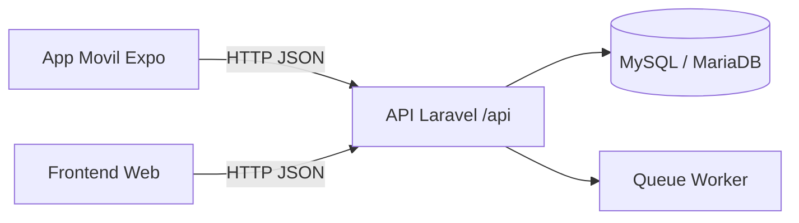

# ERP GestionEmp

Guía principal del proyecto ERP (Web + Móvil), con arquitectura, estructura de carpetas, base de datos y pasos de arranque.

## Tabla de contenido

- [1. Panorama](#1-panorama)
- [2. Arquitectura](#2-arquitectura)
- [3. Estructura del repositorio](#3-estructura-del-repositorio)
- [4. Stack tecnológico](#4-stack-tecnológico)
- [5. Requisitos de entorno](#5-requisitos-de-entorno)
- [6. Levantar todo en local](#6-levantar-todo-en-local)
- [7. Base de datos funcional](#7-base-de-datos-funcional)
- [8. Endpoints clave](#8-endpoints-clave)
- [9. Conexión con ngrok (Expo)](#9-conexión-con-ngrok-expo)
- [10. Documentación por módulo](#10-documentación-por-módulo)

## 1. Panorama

El sistema está compuesto por dos aplicaciones:

- Web (Laravel): backend API y capa web.
- Móvil (Expo): cliente para operación diaria del ERP.

La aplicación móvil consume los endpoints protegidos por token del backend.

## 2. Arquitectura



Principios de composición:

- La logica de negocio vive en Web/Laravel.
- Móvil y Web consumen la misma API.
- Inventario, ventas y compras persisten en una BD central.

## 3. Estructura del repositorio

```text
ERPGestionEmp/
|-- readmeet.md
|-- AplicacionMovil/
|   `-- VentaTotal/
|       |-- App.js
|       |-- index.js
|       |-- app.json
|       |-- package.json
|       |-- assets/
|       |-- Navigation/
|       |   `-- MainTabs.js
|       |-- Screens/
|       |   |-- LoginScreen.js
|       |   |-- RegisterScreen.js
|       |   |-- HomeScreen.js
|       |   |-- ProductosScreen.js
|       |   |-- EntradasScreen.js
|       |   |-- ProveedoresScreen.js
|       |   |-- VentasScreen.js
|       |   |-- ReportesScreen.js
|       |   `-- PerfilScreen.js
|       |-- config/
|       |   `-- api.js
|       `-- utils/
|           `-- authStorage.js
`-- AplicacionWeb/
	`-- VentaTotal/
		|-- artisan
		|-- composer.json
		|-- package.json
		|-- app/
		|   |-- Http/Controllers/
		|   `-- Models/
		|-- bootstrap/
		|-- config/
		|-- database/
		|   |-- migrations/
		|   |-- seeders/
		|   `-- factories/
		|-- public/
		|-- resources/
		|-- routes/
		|   |-- web.php
		|   `-- api.php
		|-- storage/
		|-- tests/
		`-- vendor/
```

## 4. Stack tecnológico

| Capa | Tecnologias |
|---|---|
| Backend | PHP 8.2+, Laravel 12, Sanctum |
| Front web assets | Vite, Tailwind CSS |
| Móvil | Expo SDK 54, React Native 0.81, React 19 |
| Navegación móvil | React Navigation (stack + tabs) |
| Persistencia cliente | AsyncStorage, SecureStore |
| Base de datos | MySQL 8+ / MariaDB 10.6+ |

## 5. Requisitos de entorno

Entorno soportado por el momento:

- Windows

Requeridos:

- Git
- Node.js 18+ y npm
- PHP 8.2+
- Composer 2+
- MySQL o MariaDB

Opcionales para móvil:

- Expo Go (telefono)
- Android Studio (emulador)

## 6. Levantar todo en local

### Paso 1: Backend Web

```bash
cd AplicacionWeb/VentaTotal
composer install
copy .env.example .env
php artisan key:generate
php artisan migrate
npm install
composer run dev
```

Si ya existe `.env`, puedes omitir el comando `copy`.

### Paso 2: App Móvil

```bash
cd AplicacionMovil/VentaTotal
npm install
npm start
```

### Paso 3: Validación mínima

- Backend respondiendo en `http://localhost:8000/api`.
- Login móvil exitoso.
- Consulta de productos y ventas sin error de red.

## 7. Base de datos funcional

Motor recomendado:

- MySQL 8+ o MariaDB 10.6+

### 7.1 Tablas de negocio obligatorias

- roles
- usuarios
- categorias
- estados_producto
- productos
- proveedores
- clientes
- datos_fiscales
- ventas
- detalle_venta
- movimientos_inventario
- productos_proveedor
- proveedor_producto_map
- compras
- detalle_compra

### 7.2 Tablas de infraestructura Laravel

- users
- password_reset_tokens
- sessions
- cache
- cache_locks
- jobs
- job_batches
- failed_jobs

Para autenticacion Sanctum tambien se requiere:

- personal_access_tokens

Nota importante:

- En este repositorio no se detecta una migración explícita para `personal_access_tokens`.
- Si no existe en tu BD, ejecuta `php artisan install:api` y luego `php artisan migrate`.

### 7.3 Relaciones clave

- productos.id_categoria -> categorias.id_categoria
- productos.id_estado -> estados_producto.id_estado
- ventas.id_cliente -> clientes.id_cliente
- ventas.id_dato_fiscal -> datos_fiscales.id_dato_fiscal
- detalle_venta.id_venta -> ventas.id_venta
- detalle_venta.id_producto -> productos.id_producto
- movimientos_inventario.id_producto -> productos.id_producto
- productos_proveedor.id_proveedor -> proveedores.id_proveedor
- proveedor_producto_map.id_producto_proveedor -> productos_proveedor.id_producto_proveedor
- proveedor_producto_map.id_producto -> productos.id_producto
- compras.id_proveedor -> proveedores.id_proveedor
- detalle_compra.id_compra -> compras.id_compra

### 7.4 Entidades de negocio (resumen)

| Tabla | Campos base esperados |
|---|---|
| roles | id, nombre |
| usuarios | id_usuario, nombre, telefono, correo, contrasena, id_rol |
| productos | id_producto, codigo, nombre, precio, stock, id_categoria, id_estado |
| proveedores | id_proveedor, nombre, estado |
| clientes | id_cliente, nombre |
| ventas | id_venta, fecha, total, metodo_pago, id_cliente |
| detalle_venta | id_detalle, id_venta, id_producto, cantidad, precio_unitario |
| compras | id_compra, id_proveedor, fecha, total |
| detalle_compra | id_detalle, id_compra, id_producto_proveedor, cantidad, precio_unitario |

## 8. Endpoints clave

Base local: `http://localhost:8000/api`

| Modulo | Endpoints |
|---|---|
| Auth | POST /register, POST /login, GET /me, POST /logout |
| Productos | GET/POST/PUT/DELETE /productos, GET/POST/PUT/DELETE /categorias |
| Proveedores | GET/POST/PUT/DELETE /proveedores |
| Entradas | GET/POST /entradas |
| Ventas | GET/POST /ventas, GET /ventas/{id}/detalle, POST /ventas/{id}/facturar |

## 9. Conexión con ngrok (Expo)

Si la app móvil no puede llegar al backend por IP local, puedes exponer tu API con ngrok.

### 9.1 Iniciar backend

```bash
cd AplicacionWeb/VentaTotal
php artisan serve --host=0.0.0.0 --port=8000
```

### 9.2 Exponer puerto con ngrok

```bash
ngrok http 8000
```

ngrok te dará una URL pública, por ejemplo:

- `https://abc123.ngrok-free.app`

### 9.3 Configurar la app móvil

En `AplicacionMovil/VentaTotal/config/api.js`, agrega la URL de ngrok como primer candidato:

```js
const API_CANDIDATES = [
	"https://abc123.ngrok-free.app",
	`http://172.20.10.4:${DEFAULT_PORT}`,
	Platform.OS === "android" ? `http://10.0.2.2:${DEFAULT_PORT}` : null,
	`http://127.0.0.1:${DEFAULT_PORT}`,
	`http://localhost:${DEFAULT_PORT}`,
].filter(Boolean);
```

### 9.4 Nota importante

- La URL de ngrok cambia al reiniciar el túnel (plan gratuito).
- Si cambia, actualiza `config/api.js` y reinicia Expo.

## 10. Documentación por módulo

- Móvil: `AplicacionMovil/VentaTotal/README.md`
- Web: `AplicacionWeb/VentaTotal/README.md`
